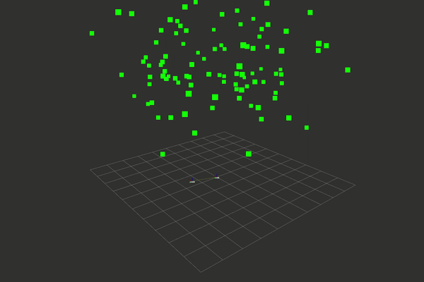

# Graph Optimization Solver for SLAM Problems

## Introduction

This is a generic framework for graph optimization, especially for solving optimization problem in **S**imultaneous **L**ocalization **A**nd **M**apping. This is very similar to g2o, but I implemented the whole optimization framework from ground up and used some of the modern features in C++11/14 to make the design more succinct. It's not fully optimized and my implementation of sparse matrix solver may not be as efficient as some existing packages, it's only just my way to learn something: implement the whole thing from ground up.

## Software Structure

### 1. Graph Optimization Problem 

A graph optimization problem consists of **vertics** and **edges** that connect vertices. Every vertex represents a state variable that we want to optimize, every edge represents an observation (noisy) between vertices it connects to. The graph can be thought as a sping system, the edges are springs and some of them are stiff (good measurement), some of them are soft (noisy measurement). The goal of graph optimization is find the configuration of vertices that can make the global spring system's enery (least square cost) lowest.

### 2. Linear Solver

The key part of graph optimization problem is solving the normal equation at each step to obtain the update vector, and we need to design an efficient solver to make it possible for large scale optimization problem. 

**Currently I implemented three types of solvers:**

1. Dense linear solver which purely solve the linear system by matrix inversion;
2. Sparse Schur solver which use sparse schur complement
3. Sparse Cholesky solver which use sparse cholesky decomposition

### 3. Nonlinear Least Square Minimizer

Graph optimization also needs a minimizer to control the optimization process and minimize the total cost. Typical nonlinear least square minimizers include Gauss-Newton, Levenberg-Marquardt and Dog-Leg Algorithm. In this work I only implemented Levenberg-Marquardt algorithm.

## To Use

### 1. Create Graph Optimization Problem

To create a graph optimization problem, you need to define the vertices in your graph and edges that connecting them. This framework doesn't support auto differentiation.

1. Define a Vertex

   Derive from BaseVertex template class, the first template parameter is dimension of minimal parametrization for update vector, the second template parameter is the internal type of state. After derived from BaseVertex template class, you need to override the update virtual function `plus` to add a update vector in minimal parametrization to your state with specified type. 

2. Define an Edge

   Derive from BaseEdge template class, the first template parameter is dimension of error vector, then specify all vertices types that this edge connected to in second template parameter pack. e.g. `class ReprojectionEdge : public BaseEdge<2,Point3DVertex, Pose3DVertex>` and `class CurveFittingEdge : public BaseEdge<1,CurveFittingVertex>`. 

   The next step is override the  `compute_errors` and `compute_jacobians` virtual functions to compute error vector and jacobian matrix given state value in vertices. To get vertex parameters, use `get_vertex` template function in BaseEdge and `parameters()` function in BaseVertex, e.g. `auto vertex0_param = get_vertex<0>()->parameters()` will get the parameters in 0th vertex specified in template parameter pack.

3. Connect Edge with Vertex

   To connect edge with vertex, you need to set vertex pointer in edge with `set_vertex` template function interface. Specify the vertex index in parameter pack as template parameter start from 0 and pass in a shared_ptr to a vertex object with corresponding type, e.g. `edge.set_vertex<0>(vertex_ptr)` will set the pointer 0th vertex specified in the template parameter pack to vertex_ptr.

4. Add vertics and edges to Problem. 

   To create a graph optimization problem, create a object of `Problem` type and use `add_vertex` and `add_edge` to add vertices and edges to problem

### 2. Solve a Graph optimization Problem

1. Create a Solver 

   After created the graph optimization problem, pass a shared_ptr to you problem object to a solver. Solver will construct a linear system from your problem and solve the linear system to obtain the update vector. You can use the solver provided in this framework or implement your own solver.

2. Create a Minimizer

   We also need a minimizer to control the optimization process and interacting with solver. Currently the framework only have Levenberg-Marquardt minimizer. Provide a `shared_ptr` to `Solver` and minimizer's configuration to create a minimizer.

3. After created solver and passed it to minimizer. Only need to call `minimize` function in minimizer to solve the graph optimization problem.

## Examples

Examples can be found in `slam_backend_solver/app` folder

### 1. Curve Fitting 

The first example is curve fitting. It only contains one vertex (curve parameters) and many edges only connect to one vertex. Since I use variadic template in `BaseEdge` class, so there's no unary edge and binary edge, you only need to specify the set of vertices' types in the template parameter.

The curve for fitting is `y = exp(a * x^2 + b * x + c)`

Ground truth: `a = 1; b = 2; c = 1`

Parameters before fitting: `a = 0; b = 0; c = 0;`

Parameters after fitting (30 iterations): `a = 1.05215; b = 1.93838; c = 1.0035`

### 2. Sparse Bundle Adjustment

Simulated sparse bundle adjustment problem with 7 poses and 100 random 3D keypoints.

### 3. Pose Graph Optimization 

Simulated Pose Graph consists of 100 poses with 386 constrains along a circle. 

(Constraints are not shown in the video below)

